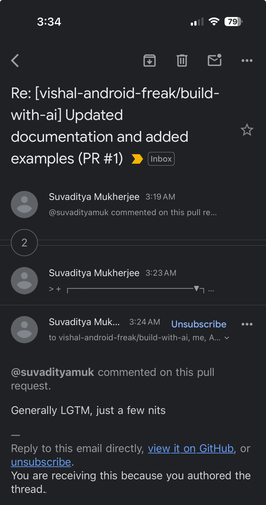
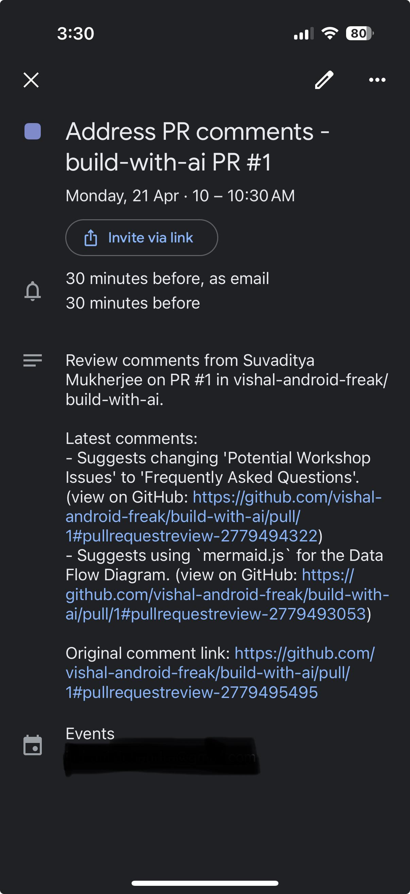
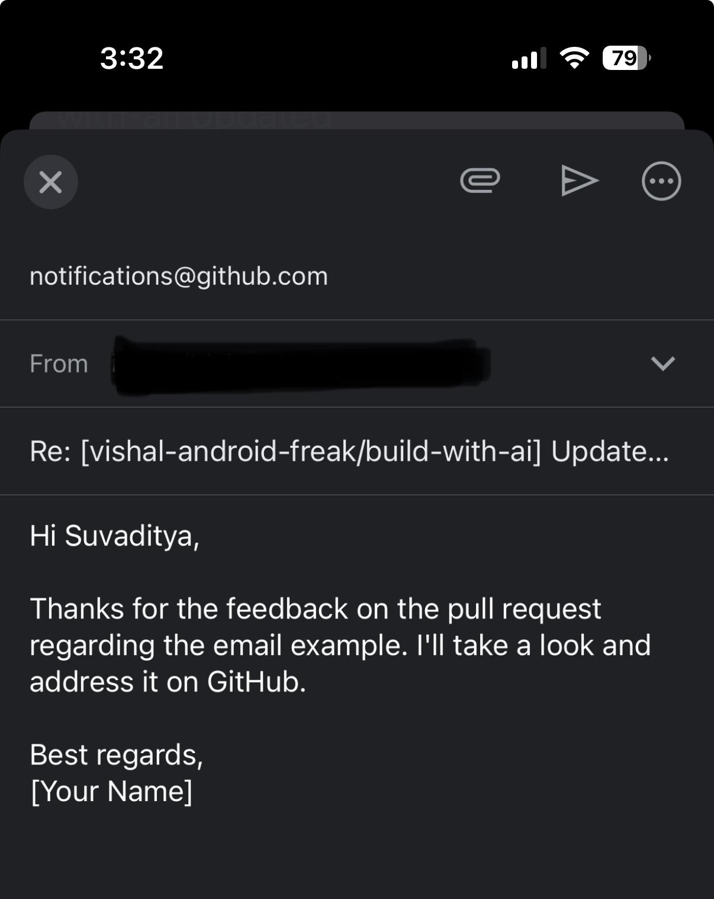
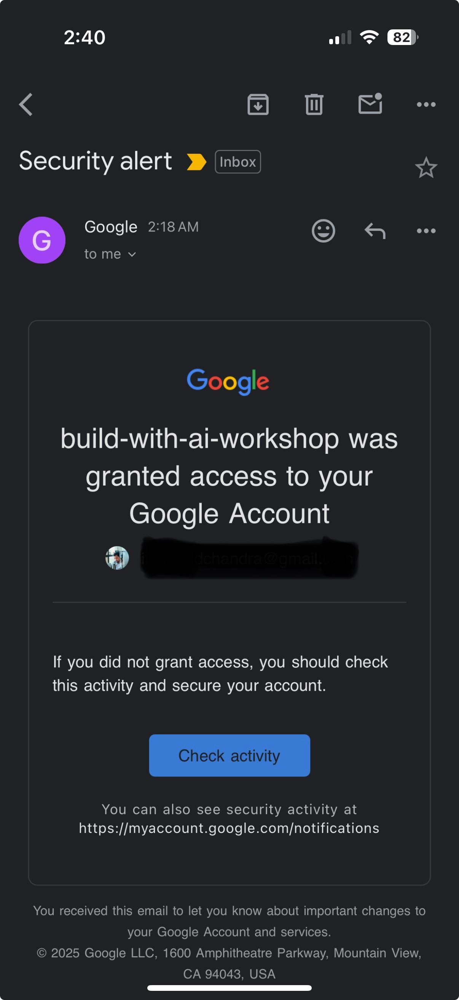
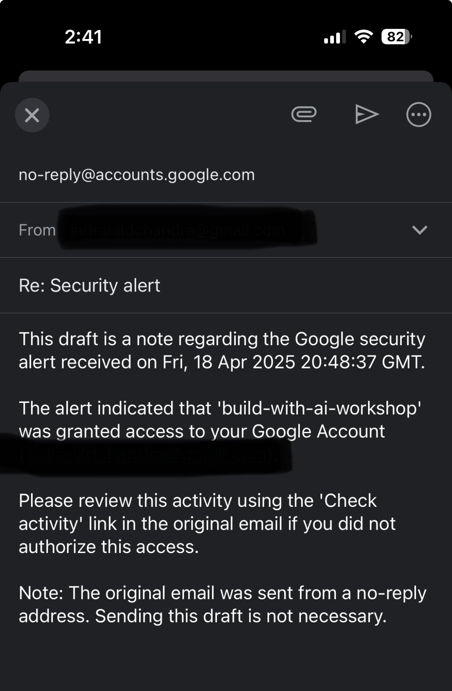

# Email Assistant

A smart email and calendar management system powered by Gemini Pro that automatically processes incoming emails and manages calendar events.

## Features

- **Automated Email Processing**: Monitors inbox for new emails every minute
- **Smart Email Responses**: Generates contextual email responses using Gemini Pro
- **Calendar Management**: Automatically handles calendar event creation, updates, and deletions
- **Gmail Integration**: Seamlessly works with Gmail for email management
- **Google Calendar Integration**: Direct integration with Google Calendar for event management

## Project Structure

```text
├── main.py              # Main application entry point
├── agents.py            # AI agents configuration and prompts
├── models.py            # AI model configurations
├── tools/
│   ├── gmail_tools.py   # Gmail API integration tools
│   ├── calendar_tools.py # Google Calendar API tools
│   └── logger.py        # Logging utilities
```

## Imp Commands
```text
powershell -ExecutionPolicy Bypass -File .\venv\Scripts\activate 
```
```text
Set-ExecutionPolicy -Scope CurrentUser -ExecutionPolicy RemoteSigned
```
```text
pip install -r requirements.txt 
```
```text
.\venv\Scripts\activate  
```
```text
python.exe -m pip install --upgrade pip
```
```text
pip install colorama 
```
## Prerequisites

- Python 3.x
- Google Cloud Project with Gmail and Calendar APIs enabled
- Google OAuth 2.0 credentials

## Installation

1. Clone the repository
2. Install dependencies:

   ```bash
   # setup a virtual environment
   python -m venv venv
   source venv/bin/activate
   pip install -r requirements.txt
   ```

3. Generate the API Key and save under `.env`
4. Set up Google OAuth 2.0 credentials and save them appropriately

## Generating & Adding the API Key in the project

1. Go to [https://aistudio.google.com/apikey](https://aistudio.google.com/apikey)

2. Click on create API Key

   

3. Select the project from the dropdown

   

   In case you do not have any existing Google Cloud Projects that appear in the dropdown, create a new Google Cloud Project at [https://console.cloud.google.com/projectcreate](https://console.cloud.google.com/projectcreate) with the name of your choice and then resume creating a new API key under this newly created project

4. Copy the generated API Key

5. Open the project in any IDE of your choice (For eg. `VSCode`)

6. Rename the file `.env.example` to `.env`

7. Paste the API Key as

   ```bash
   GOOGLE_API_KEY=AIzaXXXXXXXXXXXXXXXXXXXXXX
   ```

8. Restart the IDE so that it recognizes the API key

## Setting up OAuth 2.0 Credentials

1. Go to [https://console.cloud.google.com/auth/overview](https://console.cloud.google.com/auth/overview). Click on `Get Started`

   

2. Under App Information, give any name to your app and select your email id from the drop down under user support email and click next

   

3. Under Audience, select external and click next

   

4. Put any email id under contact information and click next

   

5. Accept the terms and conditions and click continue

   

6. Now go the clients section and click on Create Client

   

7. Select application type as desktop application and give it any name. Then press Create.

   

8. Click on Download JSON and download the credentials file

   

9. Go to the project's root directory and paste the file. Rename it to `credentials.json`. This is an essential step for our backend code to recognize the client

10. Go to the Audience section and click on Publish App

   

11. Now at the top search bar on the Google cloud dashboard, search for calendar and click on Google Calendar API

    

12. Click on Enable

    

13. Similarly, search for Google Gmail API and enable it

    

We are all set!

## Usage

Run the main application:

```bash
python main.py
```

In case you are running the app in a terminal session different from the one in which you activated virtual environment, run the app using:

```bash
source venv/bin/activate && clear && python main.py
```

The assistant will:

1. Check for new emails every minute
2. Process emails using AI to understand context and requirements
3. Generate appropriate responses and create drafts
4. Handle calendar events when scheduling is involved

## Dependencies

Key dependencies include:

- google-api-python-client: Google API client library
- langgraph: For creating reactive AI agents
- schedule: For periodic task scheduling

## Configuration

Ensure proper setup of:

1. Google OAuth 2.0 credentials
2. Gmail API access
3. Google Calendar API access

## Examples

Here are some examples of the Email Assistant in action:

### Inbox Email 1



### Calendar Event Created 1



### Response Draft 1



### Inbox Email 2



### Response Draft 2



## License

This project is licensed under the MIT License - see the [LICENSE](LICENSE) file for details.
