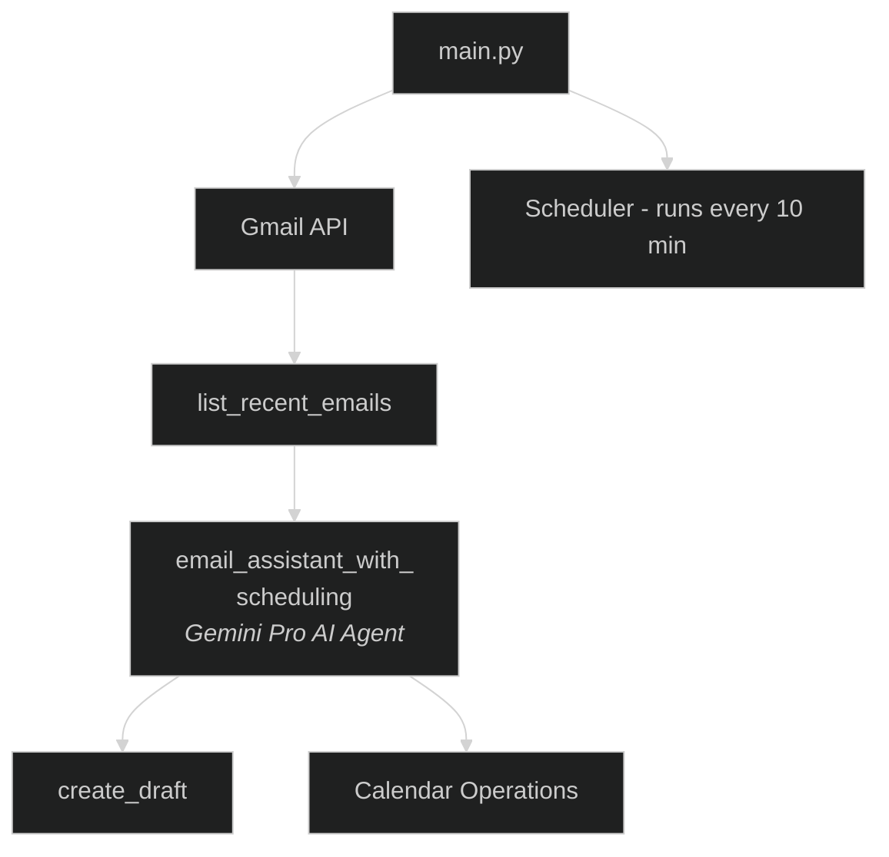

# Email Assistant Code Flow Documentation

## Overview

When `main.py` is executed, the application initializes an automated email and calendar management system powered by Gemini Pro. Here's a detailed explanation of the code flow:

## Initialization Flow

1. **Import Dependencies**
   - The main script imports necessary modules:
     - `schedule` for periodic task scheduling
     - `time` for sleep functionality
     - Gmail and Calendar tools from the `tools` package
     - The AI agent from `agents.py`
     - Logger from `tools/logger.py`

2. **Authentication Setup**
   - `get_gmail_service()` is called to:
     - Check for existing `gmail_token.pickle` file
     - If valid credentials exist, load them
     - If credentials are expired, refresh them
     - If no credentials exist, initiate OAuth flow via browser
     - Save credentials to `gmail_token.pickle` for future use
     - Return an authenticated Gmail API service

   - `ensure_valid_creds()` follows a similar process for Calendar:
     - Checks/loads `calendar_token.pickle`
     - Handles credential refresh or new authentication
     - Creates a global Calendar API service object

## Main Execution Loop

1. **Define `check_recent_emails()` function**
   - Function designed to run periodically (every 10 minutes)
   - Steps:
     - Call `list_recent_emails(minutes=10)` to get emails from the last 10 minutes
     - If no new emails found, log message and exit function
     - For each email found:
       - Log processing information
       - Stream the email content to the AI agent (`email_assistant_with_scheduling`)
       - Log each step of the AI agent's processing

2. **Define and Execute `main()` function**
   - Schedule the `check_recent_emails()` function to run every 10 minutes
   - Run `check_recent_emails()` immediately for the first check
   - Enter an infinite loop:
     - Run any pending scheduled tasks
     - Sleep for 1 second to prevent CPU overuse

## AI Agent Processing Flow

1. **`email_assistant_with_scheduling` agent (from agents.py)**
   - When an email is processed:
     - The agent receives the email content
     - It uses a ReAct (Reasoning and Acting) pattern via `create_react_agent`
     - The agent has access to these tools:
       - `create_draft`: Creates email drafts in Gmail
       - `create_calendar_event`: Creates new calendar events
       - `update_calendar_event`: Updates existing calendar events
       - `get_calendar_events`: Retrieves calendar events
       - `delete_calendar_event`: Deletes calendar events
     - The agent analyzes the email with Gemini model `gemini_2_5_pro_exp`
     - Based on content, it determines appropriate actions (reply, scheduling, etc.)

## Email Processing in Detail

1. **Email Analysis and Action Planning**
   - The agent analyzes email content to:
     - Identify important information, tasks, or meeting requests
     - Plan appropriate actions (scheduling, responding, etc.)
     - Check for existing calendar events if needed

2. **Calendar Operations (when applicable)**
   - If email requests a meeting or mentions an event:
     - `get_calendar_events()` checks for existing events
     - Depending on context:
       - `create_calendar_event()` adds new events
       - `update_calendar_event()` modifies existing events
       - `delete_calendar_event()` removes canceled events

3. **Email Response Generation**
   - The agent generates contextually appropriate responses
   - `create_draft()` function:
     - Formats the response with proper headers
     - Sets up threading for reply context
     - Creates a draft in the user's Gmail account
     - Returns success confirmation

## Continuous Monitoring

1. **Repeating Cycle**
   - After initial execution, the scheduler runs `check_recent_emails()` every 10 minutes
   - The application continues running indefinitely, monitoring for new emails
   - Each new detected email triggers the AI agent workflow

## Error Handling

1. **Exception Management**
    - The `check_recent_emails()` function includes try/except block
    - Any exceptions during processing are logged but won't crash the application
    - Specific error handling exists in calendar and Gmail tools

## Data Flow Diagram

## Authentication and Security Flow

1. **OAuth2 Authentication Cycle**
    - First run: Browser opens for user authentication
    - User grants permissions for Gmail and Calendar access
    - App receives and stores OAuth tokens
    - Subsequent runs: Tokens refreshed automatically when needed

## Frequently Asked Questions

You may encounter these common challenges:

1. **Google API Key Setup**:
   - Obtaining a Google API key and adding it to `.env` file
   - Following multiple steps in Google Cloud Console

2. **OAuth Authentication**:
   - Setting up OAuth 2.0 credentials correctly
   - Creating and downloading the `credentials.json` file
   - Handling permission prompts during first-time execution

3. **API Permissions**:
   - Enabling both Gmail and Calendar APIs in Google Cloud
   - Granting appropriate scopes during authentication

4. **Token Generation**:
   - Understanding the token generation process
   - Troubleshooting if authentication fails

5. **Dependencies**:
   - Installing all required packages
   - Handling potential version conflicts
